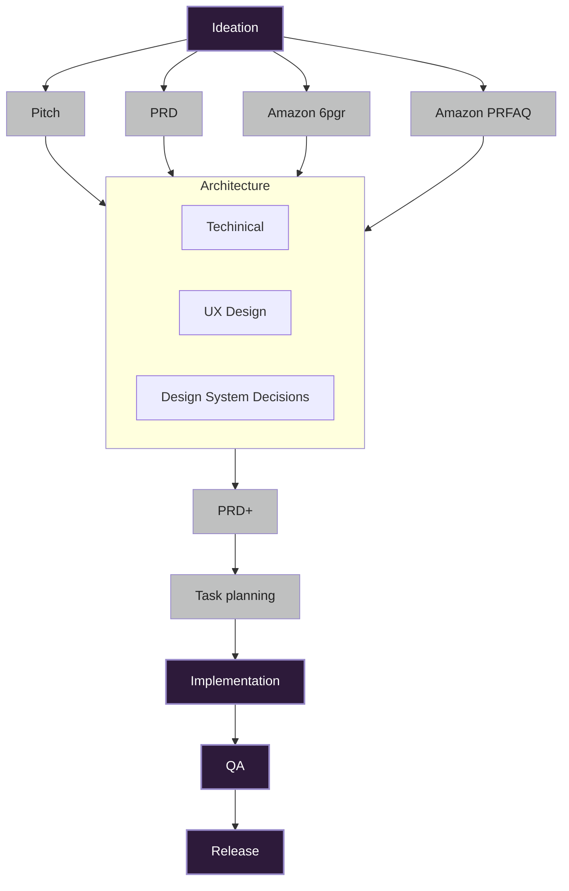

# Awesome Product Approach 

I still haven't found the universal product strategy. Engineers and Scientists tend to develop a technology in search of a Job-to-be-done, and Marketeers tend to promote before they have something really worth buying. For all it's faults, I think you have to slave away for years at something with a core value before you turn it into a product demo, so you can prove the value or iterate/pivot towards something that is valuable.

In the meantime these notes are on how tools and approaches I've found that cover the range from ideation to QA.

## The Journey(process)

The way we go from the basic product idea to a product that is ready for the market is a long one. It is not a straight line, and it is not a single process. AI will not change that, so you want to be grounded in what we already do. You should be able to make shortcuts. If you're looking to speed things up, you need to tune more than cutting down on how much code needs to be written by humans.

- Describe the problem and the solution(product)
- Put meat on the bones, create a PRD(Product Requirements Document)
- Prototype the User Experience(Mock up important features with design tools such as Figma)
- Settle on the Design System Decisions(Interaction Principles, Visual Style, Design Tokens)
- Check central User Workflows will not be broken in the product
- Define the Technical Architecture(How to build and What building blocks)
- Break down to features, components and tasks
- Write the code

It doesn't stop there though. At this point we don't know if the product is any good. We need to test it, and we need to make sure it is maintainable. We need to capture the knowledge about what we made and how, so it can be understood and improved in the future.



"You will have to learn these steps to go beyond toy examples. AI is just a multiplier on top of that"
-- Parker Rex

"Testing is going to be so-so important. QA used to be the worst developers, sorry."
-- Parker Rex

As we add more AI, the desicions will still need to be made and validated. The features still need to be implemented and someone needs to make sure they are working as intended.

## Creating Product Description

Expanding the basic idea into a product description that is comprehensive enough to determine the Architecture technically, visually and interaction wise.

- [PRD Creation Assistant](https://gist.github.com/thepian/d7c2ef88236a4942ab8f37ed08af8b45)

`Save a PRD as a new document in memory-bank folder. Create the folder and new file as needed. Create other files in the memory-bank folder as needed according to the rules.`


## Defining the Architecture

Prompts for defining the architecture:

- `Create an "design-system-decision-record" file in the "memory-bank" folder.`
- `Create a "draft-architecture" file in the "memory-bank" folder.`
- `Incorporate this logo into the design system decision record:`
- `Review all documentation files in the project, and ensure consistency. Ask me questions if it isn't clear to achive a specific point of this consistency.`

- [Architecture Decision Records](./draft-architecture.md)
- [Design System Decision Record Rule](./design-system-decision-record.mdc)
- [Can LLMs Generate Architectural Design Decisions? - An Exploratory Empirical study](https://arxiv.org/pdf/2403.01709)

Gemini did a better job coming up with the rule than Claude.


### Web, Visuals & Layout


- [Webdev Arena](https://web.lmarena.ai/leaderboard)
- [Beyond Text](https://openaccess.thecvf.com/content/CVPR2024/papers/Zhu_Beyond_Text_Frozen_Large_Language_Models_in_Visual_Signal_Comprehension_CVPR_2024_paper.pdf)
- [Visual Understanding and Reasoning LLM Models](https://verticalserve.medium.com/visual-understanding-and-reasoning-llm-models-849c0fda4d72)
- [Segmind: Visual GenAI](https://www.segmind.com/) - [Pixelflows](https://www.segmind.com/pixelflows) - [Alternatives](https://www.techjockey.com/alternatives/segmind)
- [FLUX.1 Pro, Black Forest, Image Generation](https://flux1ai.com/pro) - [FLUX 1.1](https://aipure.ai/articles/how-to-use-flux-1-1-pro-for-free)
- [Together Inference](https://www.together.ai/inference) - Run inference on 200+ open-source models powered by the Together Inference Stack and scale effortlessly in production.
- 


## Software Planning and Documentation

With AI you have to shift the way you approach coding. You have to think about it as a whole, and create
as much documentation up front as possible. This is a shift from the traditional approach of writing code and then documenting it. If you try to write it first, the AI will often create code that goes in the wrong direction. You might need a line of documentation for every 5 lines of code. So you need to get the
AI to help you write the documentation first.

I like the Claude desktop app, it's very well made, but you can also use it in the browser. Be sure the define your Projects. That way you can create project instructions and link to foundational documents for each project. You can for instance link to a GithHub repo with source code, and ask Claude to analyze it for you. Don't forget to link Google Drive and putting reference documents in there.

- [Claude Desktop App](https://claude.ai/download) - Beta
- [Gemini Pro 2.5](https://gemini.google.com/)


### Defining a Context

Context is essential for LLMs. You essentially have to give it thousands of lines for context before telling it what to do. Put files in your source code repository to cover relevant conventions for the LLM to follow. Gemini famously has a 1 million token context window, which then enables you to potentially stuff a whole specialised knowledge base together with your task in one request.

- [.cursor/rules](https://docs.cursor.com/context/rules) - A directory with rules per topic, saved in the code repository.
- [.clinerules](https://docs.cline.bot/improving-your-prompting-skills/prompting#clinerules-file) - save it in the code repository.
- [Awesome CursorRules](https://github.com/PatrickJS/awesome-cursorrules) - Tons of examples
- [Ask Gemini to remember](https://9to5google.com/2024/11/19/gemini-remember-saved-info/)
- Ask Gemini: "I use the AI Coding tool Cursor. What are the top 10 Cursor Rules for Digital Product Development"
- [CLAUDE.md](https://docs.anthropic.com/en/docs/claude-code/cli-usage) - Make sure to call /init
- [/memory-bank](https://github.com/ParkerRex/turntableai/tree/main/memory-bank) - (Origin cline) I this a new approach, looks interesting, but I haven't tried it yet. [YouTube Cline Memory Bank](https://www.youtube.com/watch?v=Uufa6flWid4&t=17s) - [How Memory Bank Works](https://cline.bot/blog/memory-bank-how-to-make-cline-an-ai-agent-that-never-forgets)
- [ipenywis/cursor-memory-bank-rules.md](https://gist.github.com/ipenywis/1bdb541c3a612dbac4a14e1e3f4341ab)
- [Git Docs MCP](gitmcp.io/docs) - Introspection on a library codebase ([Youtube intro for GitDocs MCP](https://www.youtube.com/watch?v=CYTs_Wc6nSI))
- [Context7 software lib contexts](https://context7.com)
- [Docling PDF OCR/Conversion](https://arxiv.org/abs/2408.09869)
- [How Docling turns documents into usable AI data](https://www.youtube.com/watch?v=BWxdLm1KqTU)

- Don't upgrade to the latest frameworks, they have less examples in the wild. E.g. use Tailwind 3

- Consider the arguments about using [Mermaid diagrams](https://cline.bot/blog/memory-bank-how-to-make-cline-an-ai-agent-that-never-forgets) to ensure required step in the Agentic Workflows.  [Mermaid chart designer](https://www.mermaidchart.com/app/dashboard)

Put the memory bank rules in the particular rules location and get them started by telling your Agent to "initialize memory bank". Make sure to properly add the rule and set it to "Always" apply.

## Software Development Setup

Some report Gemini Pro 2.5 to be the bleeding edge, but Claude Sonnet 3.5 and 3.7 have been widely reported as being the best, so it is what I currently use. The benefit of Gemini would be price, which cannot be ignored.

Claude Code seems to get me further faster, but it ends up being somewhat costly. It ends up costing up to $20/days on busy days. It seems to be better at introspecting the codebase. When running with Claude Code, I use VS Code with Claude code running in a Terminal tab moved into the Editor Area.

Cursor is much cheaper, but seems to mainly consider the code in the current file. Sadly you also loose out on the best programming language support.

- [Claude Code](https://www.anthropic.com/claude-code) - Beta
- [Cursor](https://cursor.com/)
- [Sonnet 3.7 + Claude Code, Feb 2025](https://www.anthropic.com/news/claude-3-7-sonnet)

For Cursor the advice is to create a new chat for each task.
 

### Other Options

- [Windsurf](https://windsurf.dev/)
- [VS Code](https://code.visualstudio.com/)
- [Gemini Pro 2.5](https://gemini.google.com/)
- [Exploring AI-Assisted Coding for iOS Development](https://academy.rudrank.com/product/ai-assisted-coding)
- [Xcursor](https://github.com/tyler6204/XCursor)
- [Roo Code](https://roocode.com)


## MCP Extensions

### Taskmaster

[github/claude-task-master](https://github.com/eyaltoledano/claude-task-master)

```bash
pnpm install -g task-master-ai
task-master init
```

Add the tokens for Claude.. At this stage it should be ready to go.


Other options
```
task-master parse-prd <path/to/prd.md>
task-master list
task-master next
task-master generate
```

## Visual Reasoning

It seems that for Visual Reasoning you should use OpenAI O1 over the competition, so when working with UI layouts, try O1 first.

Claude seems ok for turning a simple diagram into mermaid diagrams.


